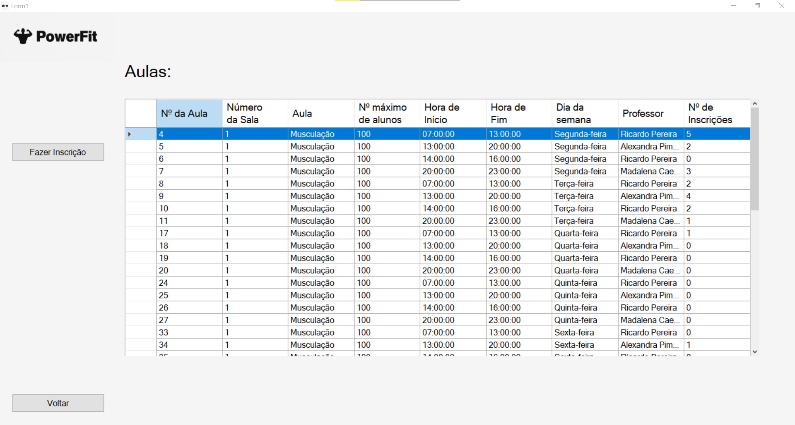

# BD: Trabalho Prático APF-T

**Grupo**: P4G5
- João Luís, NMEC: 107403
- Diana Miranda, NMEC: 107457

## Introdução / Introduction
 
Para o nosso projeto de Bases de Dados, estamos a desenvolver um Sistema de Gestão de um Ginásio. O principal objetivo deste sistema é proporcionar aos gerentes, clientes e recepcionistas uma ferramenta eficiente e assertiva para gerir todas as operações necessárias de forma otimizada.
Nesta entrega temos a análise de requisitos, o Diagrama Entidade-Relacionamento o Esquema Relacional, os ficheiros para criação e inicialização da base de dados, os ficheiros com as funções necessárias para consulta, inserção, atualização e remoção de dados da base de dados e também o código com a implementação de uma interface para realizar todas estas operações.

## ​Análise de Requisitos / Requirements

* Um cliente é caracterizado por nome, CC, data de nascimento, morada, contribuinte, número telemóvel e email.
* Quando um cliente se inscreve pela primeira vez no ginásio, é necessário subscrever um plano de adesão que pode ser mensal, anual ou semanal.
* Um plano de adesão é definido pelo tipo, preço, data de início, data de fim.
* Quando um plano de adesão é criado pelo Rececionista, é emitido um pagamento para o cliente realizar, que aquando realizado é registada a data. Este pagamento é caracterizado por um ID, valor, método, estado, data de vencimento e data de cancelamento (se se aplicar).
* Todos os membros do staff são identificados por número de funcionário, nome, CC, NIF, data de nascimento, e-mail, número de telemóvel, morada, horário de trabalho, salário e data de contratação.
* O cliente tem a opção de solicitar um plano de treino a um professor. Esse plano é definido por um ID, data de início, data de fim e número de treinos por semana. Para cada exercício, é necessário especificar o ID, nome e quando este é incluído num plano é possível definir o número de séries, número de repetições e tempo de execução. O exercício pode utilizar ou não um equipamento.
* O equipamento é caracterizado por ID e nome.
* O professor faz parte do staff, no entanto tem também de entregar as suas certificações.
* O professor pode dar aulas no ginásio, que são identificadas por um ID. É registado em cada aula a sala onde se vai realizar. Cada aula pode ser realizada em vários horários diferentes. Cada horário é definido pela hora de início e fim e pelo dia da semana em que se vai realizar.
* Cada sala é definida por um ID, número máximo de alunos e tipo.
* O cliente pode inscrever-se em várias aulas desde que haja disponibilidade e a inscrição seja aceite.
* O cliente tem a opção de fornecer feedback sobre o seu plano de treino ao treinador que o criou. Este feedback é caracterizado pela data e comentários associados.
* Embora seja um membro do staff, o gerente tem a responsabilidade de gerir a equipa de funcionários.

## DER - Diagrama Entidade Relacionamento/Entity Relationship Diagram

### Versão final/Final version


## ER - Esquema Relacional/Relational Schema

### Versão final/Final Version


### APFE

As alterações em relação à última entrega incluiram a transformação do Feedback numa relação, em vez de uma entidade, e a definição do relacionamento 'is-a' como disjoint, no que diz respeito à entidade Staff, estabelecendo a exclusividade entre as especializações. Com isto, um membro do staff pode ser apenas um Professor, um Rececionista ou um Gerente, não podendo ser definido como duas ou mais dessas especializações simultaneamente.
Por último acrescentámos à relação Subscreve um atributo Data.

## ​SQL DDL - Data Definition Language

[SQL DDL File](sql/01_ddl.sql "SQLFileQuestion")

## SQL DML - Data Manipulation Language

### Formulario exemplo/Example Form
### Menu


```sql
-- Uso da SP CheckIDExists para verificar se o ID é válido
Ginasio.CheckIDExists
```
### Página do Cliente


```sql
-- Uso de uma UDF para ver as aulas em que o cliente estava inscrito
SELECT * FROM Ginasio.funcAulasInscritas(@ccCliente)

-- Mostrar nome do cliente
SELECT Fname, Lname FROM Ginasio.Cliente WHERE CC = @ccCliente
```


```sql
-- Uso de uma UDF para ver o plano de treino
SELECT * FROM Ginasio.funcPlanoTreinoCliente(@idCliente)
```


```sql
-- Uso da SP CheckIDExists para verificar se o ID do professor é válido
Ginasio.CheckIDExists

-- Inserir dados na tabela Feedback
INSERT INTO Ginasio.Feedback(CC_Cliente, ID_Professor, Comentários, Data) Values (@cc, @idProf, @comment, @data)
```

### Página do Gerente


```sql
-- Uso de UDFs para ver estatisticas de numero de incrições em aulas, tipos de planos de adesão, estados de pagamentos e médias de salário
SELECT * FROM Ginasio.Inscricoes()
SELECT * FROM Ginasio.TiposPlanosAdesao()
SELECT * FROM Ginasio.EstadoPagamentos()
SELECT * FROM Ginasio.MediasSalarios()
```


```sql
-- Ver dados
SELECT * FROM Ginasio.Staff Join Ginasio.Professor On Ginasio.Professor.Num_func = Ginasio.Staff.Num_func
SELECT * FROM Ginasio.Staff Join Ginasio.Rececionista On Ginasio.Rececionista.Num_func = Ginasio.Staff.Num_func
SELECT * FROM Ginasio.Staff Join Ginasio.Gerente On Ginasio.Gerente.Num_func = Ginasio.Staff.Num_func
SELECT COUNT(*) FROM Ginasio.{tableName} WHERE Num_func = @NumFuncionario
SELECT Fname + ' ' + Lname FROM Ginasio.{tableName} WHERE Num_func = @numGerente
SELECT certificacoes FROM Ginasio.{tableName} WHERE Num_func = @numFunc

--Inserir dados
INSERT INTO Ginasio.Staff (CC, Fname, Lname, Email, Telemovel, NIF, Morada, Data_Nasc, Salario, Num_func, Data_Contr, Horario_Lab, Gerente_Num) 
VALUES (@CC, @Fname, @Lname, @Email, @Telemovel, @NIF, @Morada, @Data_Nasc, @Salario, @Num_func, @Data_Contr, @Horario, @Gerente_Num)

INSERT INTO Ginasio.Professor (Num_func) VALUES (@Num_func)
INSERT INTO Ginasio.Gerente (Num_func) VALUES (@Num_func)
INSERT INTO Ginasio.Rececionista (Num_func) VALUES (@Num_func)

-- Atualizar dados
UPDATE Ginasio.Staff " + "SET Fname = @Fname, " + "Lname = @Lname, " + " Email = @Email, " + " Telemovel = @Telemovel, " + " Morada = @Morada, " + " Data_Nasc = @Data_Nasc, " + " Gerente_Num = @Gerente_Num, " + " Salario = @Salario, " + " Horario_Lab = @Horario " + "WHERE Num_func = @Num_func
```
### Página do Professor

```sql
-- UDF Para ver o horario de um professor
SELECT * FROM Ginasio.funcHorarioProfessor(@IDinical)

-- Mostrar nome do funcionário
SELECT Fname, Lname FROM Ginasio.Staff WHERE Num_func = @IDinicial
```


```sql
-- Mostrar o feedback associado aquele professor, mostrando o nº de CC, o nome e a data do feedback por parte do cliente.
Select CC_Cliente, Fname, Lname, Comentários, [Data] from Ginasio.Feedback join Ginasio.Cliente on CC= CC_Cliente where ID_Professor = @idProf
```

```sql
-- Selecionar o nome
Select Fname, Lname From Ginasio.Cliente Where CC = @ccCliente

-- Inserir dados
INSERT INTO Ginasio.Plano_Treino(ID, Data_Inicio, Data_Fim, Num_Treinos_Semanais, ID_Professor, CC_Cliente) VALUES (@ID, @DataIn, @DataFim, @nTreinos, @idProf, @idCliente)

-- Seleção dos dados para posteriormente ser calculada a idade dos clientes
SELECT YEAR(Data_Nasc) AS Ano FROM Ginasio.Cliente WHERE CC = @idCliente
```


```sql
-- Chamar a Stored Procedure para inserir um exercício (Elevação dos joelhos selecionado)
Ginasio.InserirExercicioNumPlanoTreino

-- Stored Procedure para eliminar um exercício (o exercício tem de estar selecionado)
Ginasio.EliminarExercicioNumPlanoTreino

-- Preencher a tabela com os dados do plano de treino através de uma UDF
SELECT * FROM Ginasio.funcPlanoTreinoCliente(@idCliente)

-- Obter a lista de exercícios (lista da direita) ordenada por ordem alfabética
SELECT Nome FROM Ginasio.Exercicio ORDER BY Nome
```


```sql
-- Obter todos os números de cliente associados aquele professor (para aparecer no dropdown do canto superior direito)
SELECT CC_cliente FROM Ginasio.Professor JOIN Ginasio.Plano_Treino ON Ginasio.Professor.Num_func = Ginasio.Plano_Treino.ID_Professor WHERE Ginasio.Professor.Num_func = @IDinical

-- UDF para ver o plano de treino de um cliente
SELECT * FROM Ginasio.funcPlanoTreinoCliente(@idCliente)
```
### Página do Rececionista

```sql
-- Obter o nome do rececionista
SELECT Fname, Lname FROM Ginasio.Staff WHERE Num_func = @IDinicial

-- Ver os planos de adesão criados por aquele rececionista
Select * From Ginasio.Plano_Adesao Where Num_Rec = @numFunc
```


```sql
-- Ver dados
SELECT * FROM Ginasio.Cliente

-- Atualizar dados
UPDATE Ginasio.Cliente " + "SET Fname = @Fname, " + "Lname = @Lname, " + " Email = @Email, " + " Telemovel = @Telemovel, " + " NIF = @NIF, " + " Morada = @Morada, " + " Data_Nasc = @Data_Nasc " + "WHERE CC = @CC

-- Inserir um novo cliente
INSERT INTO Ginasio.Cliente (CC, Fname, Lname, Email, Telemovel, NIF, Morada, Data_Nasc) " + "VALUES (@CC, @Fname, @Lname, @Email, @Telemovel, @NIF, @Morada, @Data_Nasc)

-- Eliminar Cliente através de uma Stored Procedure
Ginasio.EliminarCliente
```


```sql
-- Inserir um novo plano de adesão
INSERT INTO Ginasio.Plano_Adesao (Tipo, CC_Cliente, Preco, Data_Fim, Data_Inicio, Num_Rec) " + "VALUES (@tipo, @cc, @preco, @dataFim, @dataInicio, @numRec)

--Quando o plano de adesão é guardado para um cliente que já tenha um plano, o seguinte trigger é ativado:
Ginasio.VerificarClientePlanosAdesao
```


```sql
-- Ver os dados.
-- Para ser possível ver em tabela, usámos um data grid view.
-- Esta permite ordenar por colunas, carregando na coluna em questão.
SELECT * FROM Ginasio.Pagamento
```
```csharp
// Para ser possível filtrar os dados, usámos um data view:
dataView.RowFilter = $"Estado = '{valorFiltro}'";
tabelaPagamentos.DataSource = dataView.ToTable();
```
#### Carregando no botão "Editar":


#### A página guarda o contexto da página anterior (ou seja, que estado estava selecionado, o método, etc)
```sql
-- Atualizar os dados
UPDATE Ginasio.Pagamento SET Estado = @estado, Data_Pagamento = @dataPag, Data_canc = @dataCanc WHERE ID = @idPag
```



```sql
--- Ver os dados relativos às aulas através de uma View
--- Foi feita a organização dos dados por número da sala
--- e por dia da semana, esta fora da View
SELECT * FROM Ginasio.Salas_AND_Aulas_VIEW ORDER BY [Número da Sala],
CASE [Dia da semana] 
WHEN 'Segunda-feira' THEN 1 
WHEN 'Terça-feira' THEN 2 
WHEN 'Quarta-feira' THEN 3 
WHEN 'Quinta-feira' THEN 4 
WHEN 'Sexta-feira' THEN 5 
WHEN 'Sábado' THEN 6 
WHEN 'Domingo' THEN 7 
ELSE 8 END
```
#### Carregando no botão "Fazer Inscrição"


```sql
--- Inserir os dados para fazer a inscrição na aula
INSERT INTO Ginasio.Inscreve (ID_HAula, CC_Cliente, Estado) VALUES (@nAula, @cc, @estado)
```

## Normalização/Normalization

Ao avaliarmos o nosso sistema, percebemos que ele já se encontrava na terceira forma normal. Isto deve-se ao facto de termos sido cuidadosos ao avaliar o Diagrama de Entidade e Relacionamento (DER) para criar o Esquema Relacional. Desde o início, tivemos o cuidado de garantir que as tabelas possuíssem atributos atómicos, não suportassem relações dentro de relações e não tivessem dependências parciais.

## Índices/Indexes

Para otimizar a velocidade de execução das pesquisas por nome e ID de cliente e funcionário, bem como as pesquisas por exercício num plano de treino, utilizámos índices. Embora a nossa base de dados seja relativamente pequena, decidimos implementar esta estrutura nestas tabelas devido seu uso frequente.

```sql
CREATE INDEX idxNomeCliente ON Ginasio.Cliente(Fname, Lname);

CREATE INDEX idxNomeStaff ON Ginasio.Staff(Fname, Lname);

CREATE INDEX idxCCliente ON Ginasio.Cliente(CC);

CREATE INDEX idxExerciciosPlanoTreino ON Ginasio.Inclui(ID_Ex, ID_PT);

CREATE INDEX idxNumFuncProfessor ON Ginasio.Professor(Num_func);
```

## SQL Programming: Stored Procedures, Triggers, UDF

[SQL SPs and Functions File](sql/02_sp_functions.sql "SQLFileQuestion")

[SQL Triggers File](sql/03_triggers.sql "SQLFileQuestion")

## Outras notas/Other notes

### Dados iniciais da base de dados/Database init data

[Database Init File](sql/04_db_init.sql "SQLFileQuestion")

### View utilizada

[View File](sql/05_any_other_matter.sql "SQLFileQuestion")

### Para executar o nosso programa:
A ligação ao servidor de SQL é feita na página BDConnection.cs, para executar o nosso programa é necessário atualizar essa ligação para a correta.


 