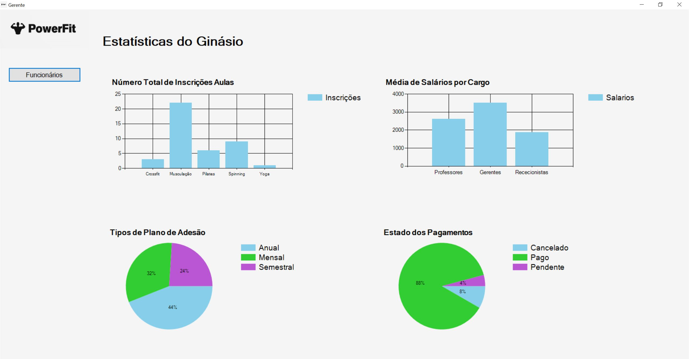

# BD: Trabalho Prático APF-T

**Grupo**: P4G5
- João Luís, NMEC: 107403
- Diana Miranda, NMEC: 107457

# Instructions - TO REMOVE

Este template é flexível.
É sugerido seguir a estrutura, links de ficheiros e imagens, mas adicione ou remova conteúdo sempre que achar necessário.

---

This template is flexible.
It is suggested to follow the structure, file links and images but add more content where necessary.

The files should be organized with the following nomenclature:

- sql\01_ddl.sql: mandatory for DDL
- sql\02_sp_functions.sql: mandatory for Store Procedure, Functions,... 
- sql\03_triggers.sql: mandatory for triggers
- sql\04_db_init.sql: scripts to init the database (i.e. inserts etc.)
- sql\05_any_other_matter.sql: any other scripts.

Por favor remova esta secção antes de submeter.

Please remove this section before submitting.

## Introdução / Introduction
 
Para o projeto de Bases de Dados, decidimos desenvolver um Sistema de Gestão de Ginásios. Com este sistema, pretendemos proporcionar aos gestores do ginásio uma ferramenta eficaz para gerir todas as operações de forma mais eficiente e assertiva.
Nesta entrega temos a análise de requisitos, o Diagrama Entidade-Relacionamento e o Esquema Relacional para a base de dados a desenvolver no resto do projeto.  

## ​Análise de Requisitos / Requirements

* Um cliente é caracterizado por nome, CC, data de nascimento, morada, contribuinte, número telemóvel e email.
* Quando um cliente se inscreve pela primeira vez no ginásio, é necessário subscrever um plano de adesão que pode ser mensal, anual ou semanal.
* Um plano de adesão é definido pelo tipo, preço, data de início, data de fim.
* Quando um plano de adesão é criado pelo Rececionista, é emitido um pagamento para o cliente realizar, que aquando realizado é registada a data. Este pagamento é caracterizado por um ID, valor, método, estado, data de vencimento e data de cancelamento (se se aplicar).
* Todos os membros do staff são identificados por número de funcionário, nome, CC, NIF, data de nascimento, e-mail, número de telemóvel, morada, horário de trabalho, salário e data de contratação.
* O cliente tem a opção de solicitar um plano de treino a um professor. Esse plano é definido por um ID, data de início, data de fim e número de treinos por semana. Para cada exercício, é necessário especificar o ID, nome e quando este é incluído num plano é possível definir o número de séries, número de repetições e tempo de execução. O exercício pode utilizar ou não um equipamento.
* O equipamento é caracterizado por ID e nome.
* O professor faz parte do staff, no entanto tem também de entregar as suas certificações.
* O professor pode dar aulas no ginásio, que são identificadas por um ID. É registado em cada aula a sala onde se vai realizar. Cada aula pode ser realizada em vários horários diferentes. Cada horário é definido pela hora de início e fim e pelo dia da semana em que se vai realizar.
* Cada sala é definida por um ID, número máximo de alunos e tipo.
* O cliente pode inscrever-se em várias aulas desde que haja disponibilidade e a inscrição seja aceite.
* O cliente tem a opção de fornecer feedback sobre o seu plano de treino ao treinador que o criou. Este feedback é caracterizado pela data e comentários associados.
* Embora seja um membro do staff, o gerente tem a responsabilidade de gerir a equipa de funcionários.

## DER - Diagrama Entidade Relacionamento/Entity Relationship Diagram

### Versão final/Final version


## ER - Esquema Relacional/Relational Schema

### Versão final/Final Version


### APFE

As alterações em relação à última entrega incluram a transformação do Feedback numa relação, em vez de uma tabela, e a definição do relacionamento 'is-a' como disjoint, no que diz respeito à entidade Staff, estabelecendo a exclusividade entre as especializações. Com isto, um membro do staff pode ser apenas um Professor, um Rececionista ou um Gerente, não podendo ser definido como duas ou mais dessas especializações simultaneamente.
Por último acrescentámos à relação Subscreve um atributo Data.

## ​SQL DDL - Data Definition Language

[SQL DDL File](sql/01_ddl.sql "SQLFileQuestion")

## SQL DML - Data Manipulation Language

Uma secção por formulário.
A section for each form.

### Formulario exemplo/Example Form


```sql
-- Uso da SP CheckIDExists para verificar se o ID é válido
Ginasio.CheckIDExists

```


```sql
-- Uso de uma UDF para ver as aulas em que o cliente estava inscrito
SELECT * FROM Ginasio.funcAulasInscritas(@ccCliente)

-- Mostrar nome do cliente
SELECT Fname, Lname FROM Ginasio.Cliente WHERE CC = @ccCliente
```


```sql
-- Uso de uma UDF para ver o plano de treino
SELECT * FROM Ginasio.funcPlanoTreinoCliente(@idCliente)
```


```sql
-- Uso da SP CheckIDExists para verificar se o ID do professor é válido
Ginasio.CheckIDExists

-- Inserir dados na tabela Feedback
INSERT INTO Ginasio.Feedback(CC_Cliente, ID_Professor, Comentários, Data) Values (@cc, @idProf, @comment, @data)
```



```sql
-- Uso de UDFs para ver estatisticas de numero de incrições em aulas, tipos de planos de adesão, estados de pagamentos e médias de salário
SELECT * FROM Ginasio.Inscricoes()
SELECT * FROM Ginasio.TiposPlanosAdesao()
SELECT * FROM Ginasio.EstadoPagamentos()
SELECT * FROM Ginasio.MediasSalarios()
```


```sql
-- Ver dados
SELECT * FROM Ginasio.Staff Join Ginasio.Professor On Ginasio.Professor.Num_func = Ginasio.Staff.Num_func
SELECT * FROM Ginasio.Staff Join Ginasio.Rececionista On Ginasio.Rececionista.Num_func = Ginasio.Staff.Num_func
SELECT * FROM Ginasio.Staff Join Ginasio.Gerente On Ginasio.Gerente.Num_func = Ginasio.Staff.Num_func
SELECT COUNT(*) FROM Ginasio.{tableName} WHERE Num_func = @NumFuncionario
SELECT Fname + ' ' + Lname FROM Ginasio.{tableName} WHERE Num_func = @numGerente
SELECT certificacoes FROM Ginasio.{tableName} WHERE Num_func = @numFunc

--Inserir dados
INSERT INTO Ginasio.Staff (CC, Fname, Lname, Email, Telemovel, NIF, Morada, Data_Nasc, Salario, Num_func, Data_Contr, Horario_Lab, Gerente_Num) 
VALUES (@CC, @Fname, @Lname, @Email, @Telemovel, @NIF, @Morada, @Data_Nasc, @Salario, @Num_func, @Data_Contr, @Horario, @Gerente_Num)

INSERT INTO Ginasio.Professor (Num_func) VALUES (@Num_func)
INSERT INTO Ginasio.Gerente (Num_func) VALUES (@Num_func)
INSERT INTO Ginasio.Rececionista (Num_func) VALUES (@Num_func)

-- Atualizar dados
UPDATE Ginasio.Staff " + "SET Fname = @Fname, " + "Lname = @Lname, " + " Email = @Email, " + " Telemovel = @Telemovel, " + " Morada = @Morada, " + " Data_Nasc = @Data_Nasc, " + " Gerente_Num = @Gerente_Num, " + " Salario = @Salario, " + " Horario_Lab = @Horario " + "WHERE Num_func = @Num_func
```

...

## Normalização/Normalization

Ao avaliarmos o nosso sistema, percebemos que ele já se encontrava na terceira forma normal. No entanto, isto deveu-se ao facto de termos tido o cuidado de colocar numa tabela à parte os atributos que antes eram multi-valor, garantindo assim a sua atomicidade.
````
Retirar isto depois!
Descreva os passos utilizados para minimizar a duplicação de dados / redução de espaço.
Justifique as opções tomadas.
Describe the steps used to minimize data duplication / space reduction.
Justify the choices made.
````

## Índices/Indexes

Foram utilizados índices para otimizar a velocidade de execução das pesquisas por nome de cliente e funcionário, e pelo do ID do cliente, exercício no plano de treino e professor. Apesar de nossa base de dados ser relativamente pequena, optamos por implementar essa estrutura nessas tabelas devido à sua alta frequência de uso.

```sql
CREATE INDEX idxNomeCliente ON Ginasio.Cliente(Fname, Lname);

CREATE INDEX idxNomeStaff ON Ginasio.Staff(Fname, Lname);

CREATE INDEX idxCCliente ON Ginasio.Cliente(CC);

CREATE INDEX idxExerciciosPlanoTreino ON Ginasio.Inclui(ID_Ex, ID_PT);

CREATE INDEX idxNumFuncProfessor ON Ginasio.Professor(Num_func);
```

## SQL Programming: Stored Procedures, Triggers, UDF

[SQL SPs and Functions File](sql/02_sp_functions.sql "SQLFileQuestion")

[SQL Triggers File](sql/03_triggers.sql "SQLFileQuestion")

## Outras notas/Other notes

### Dados iniciais da base de dados/Database init data

[Database Init File](sql/04_db_init.sql "SQLFileQuestion")

### View utilizada

[View File](sql/05_any_other_matter.sql "SQLFileQuestion")


 