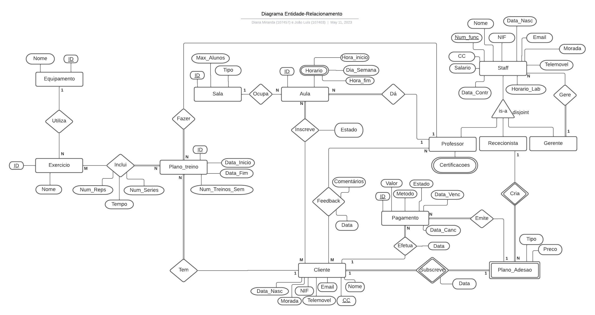
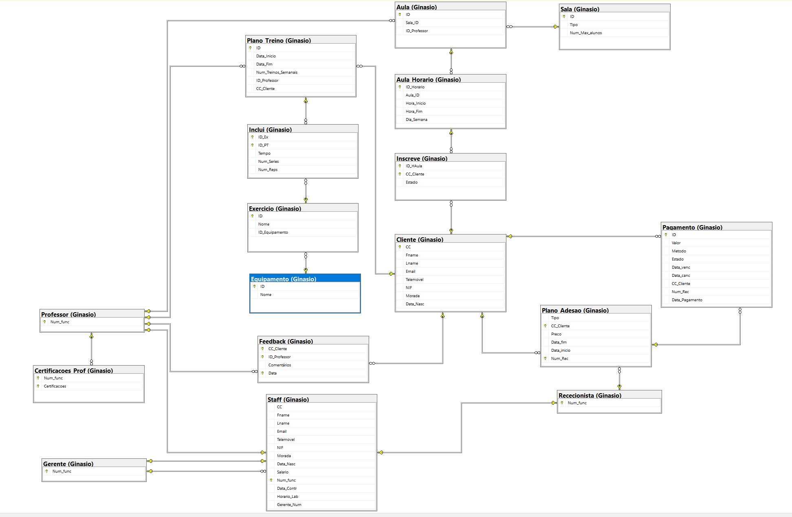

# BD: Trabalho Prático APFE

**Grupo**: P4G5
- João Luís, NMEC: 107403
- Diana Miranda, NMEC: 107457

## Introdução / Introduction
 
Escreva uma pequena introdução sobre o trabalho.

## ​Análise de Requisitos / Requirements

## DER

## ER

